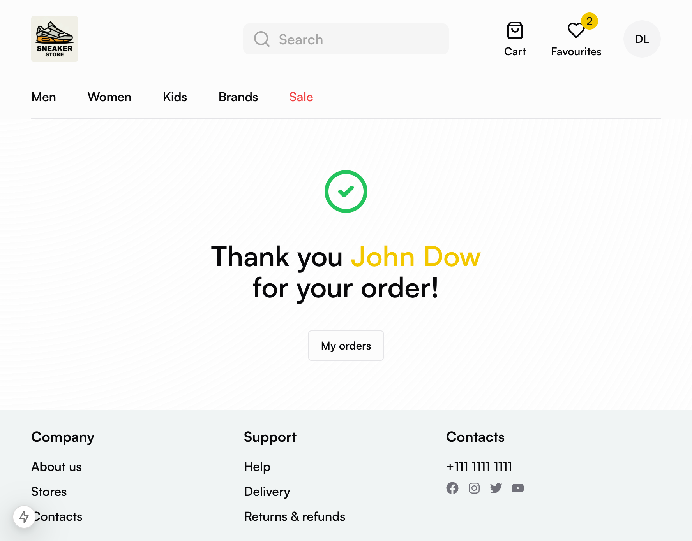

# Sneakers store

A fullstack e-commerce shop with admin dashboard.

<div style="display:flex;flex-wrap:wrap;gap:4px">
  
  
  
  
  
  
  
  
  
  
  
  
  
  
  
  
</div>

## Features

- User authentication (using credentials on dashboard and Google on storefront)
- Products filtering by price, categories, brands, colors, sizes. Sorting by price
- Products search
- Cart with persisted products (using browser for guests or database for
  authenticated users)
- Checkout and payment using Stripe
- Orders history
- Favorite products
- Featured products
- Admin dashboard for product management and analytics like total, monthly
  revenue
- Discounts (fixed or percentage)
- Organized in monorepo utilizing ts-rest for better DX and type safety among frontend
  and backend

## Technologies used

- Frontend: Typescript, Nextjs, Tailwindcss, Shadcn/ui, MaterialUI,
  NextAuth.js, Cloudinary
- Backend: Nodejs, Nestjs, Postgresql, Drizzle ORM
- Payments: Stripe
- Type safety: Typescript, TS-REST
- Code quality: Eslint, Prettier

## Development

- [Frontend preparation](/apps/web-store/README.md)
- [Dashboard preparation](/apps/dashboard/README.md)
- [Backend preparation](/apps/backend/README.md)

Build contracts lib:

```bash
pnpm -F contracts build
```

Build auth lib:

```bash
pnpm -F next-auth build
```

Run the development server for backend:

```bash
pnpm api:dev
```

Run the development servers for frontend:

```bash
pnpm dev
```

## TODO

- [x] products and filters
- [x] featured products
- [x] search by products
- [x] cart
- [x] payment and orders
- [x] favorites
- [ ] rating and comments
- [x] simple analytics in dashboard
- [ ] improve build process
- [ ] deploy
